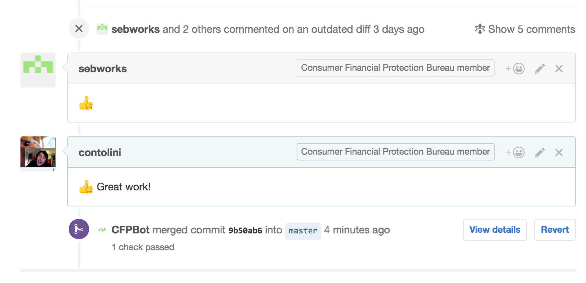

# hubot-lgtm [](https://travis-ci.org/catops/hubot-lgtm) [](https://www.npmjs.com/package/hubot-lgtm)

Automatically merge pull requests after contributors have given the thumbs up.



## Installation

1. In your hubot's project repo, run `npm install hubot-lgtm --save`
1. Add **hubot-lgtm** to your hubot's `external-scripts.json`.
1. Create a GitHub account for your hubot if you haven't already.
1. Create a [personal API token](https://github.com/blog/1509-personal-api-tokens) using your bot's GH account and store it as `HUBOT_LGTM_GITHUB_TOKEN`.
1. If you use Slack or Mattermost, define `HUBOT_LGTM_GITHUB_ROOM` with the name of the room you'd like the bot to report to.

## Usage

1. [Assign a pull request](https://help.github.com/articles/assigning-issues-and-pull-requests-to-other-github-users/) to your bot's GH user.
1. Review the PR as you normally would. Once its good-to-go, post a comment consisting solely of 👍 (or `LGTM`, `:+1:` or `:shipit:`).
1. After the PR has at least two approval comments from your team, the bot will merge it.

Your bot will check its assigned pull requests every 60 seconds.
The polling interval can be changed by defining `HUBOT_LGTM_INTERVAL`.

At any time, you can request a list of pull requests that have been assigned to your bot:

```
user1>> hubot list your pull requests
hubot>> I'm monitoring these pull requests:
- https://github.com/catops/hubot-lgtm/pull/12
- https://github.com/catops/hubot-lgtm/pull/29
```

## Contributing

Please read our general [contributing guidelines](CONTRIBUTING.md).

## Open source licensing info
1. [TERMS](TERMS.md)
2. [LICENSE](LICENSE)
3. [CFPB Source Code Policy](https://github.com/cfpb/source-code-policy/)
